# 📊 DIAGRAMAS VISUAIS: Sistema de Conversas & AI Agents

> **Representações visuais do funcionamento do sistema**

---

## 🔄 DIAGRAMA 1: Fluxo Completo de Mensagem

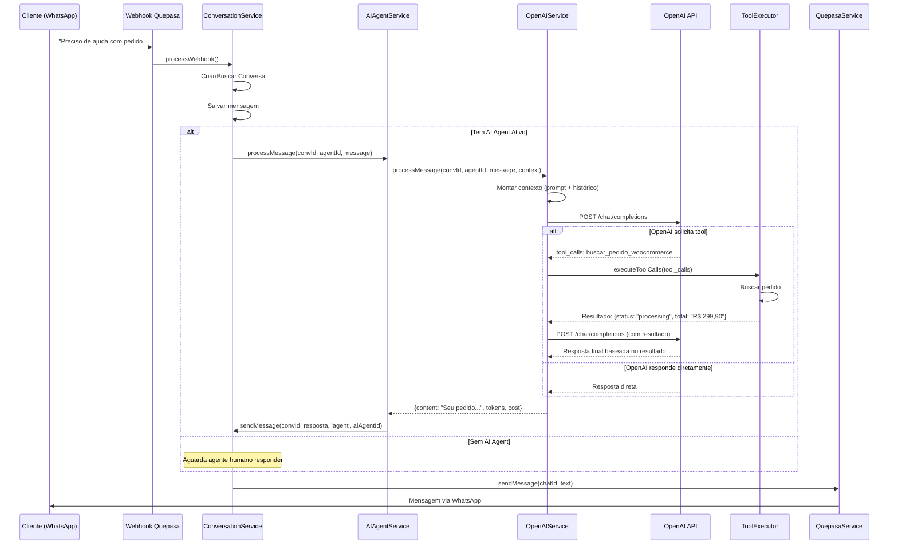

---

## 🏗️ DIAGRAMA 2: Arquitetura de Componentes

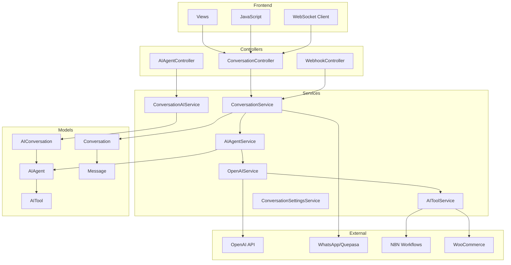

---

## 💾 DIAGRAMA 3: Modelo de Dados

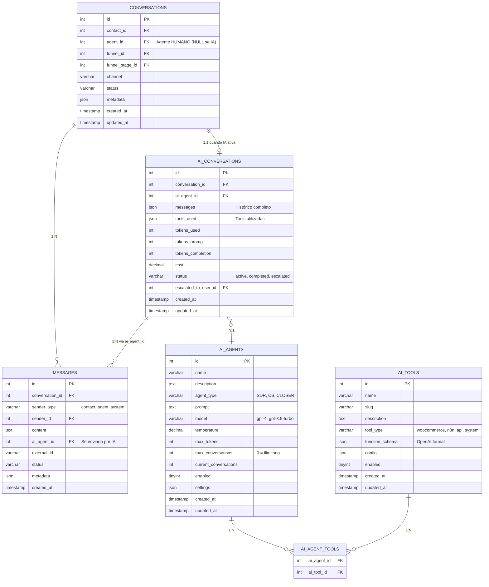

---

## 🔀 DIAGRAMA 4: Decisão de Atribuição

```mermaid
flowchart TD
    START([Nova Conversa Criada]) --> CHECK_HISTORY{Contato tem<br/>histórico?}
    
    CHECK_HISTORY -->|SIM| GET_PREV[Buscar agente anterior<br/>ContactAgentService]
    CHECK_HISTORY -->|NÃO| CHECK_AUTO{Distribuição<br/>automática<br/>habilitada?}
    
    GET_PREV --> HAS_PREV{Encontrou<br/>agente?}
    HAS_PREV -->|SIM| ASSIGN_PREV[Atribuir mesmo agente]
    HAS_PREV -->|NÃO| CHECK_AUTO
    
    CHECK_AUTO -->|NÃO| NO_ASSIGN[Deixar sem atribuição<br/>agent_id = NULL]
    CHECK_AUTO -->|SIM| GET_METHOD{Qual método?}
    
    GET_METHOD -->|round_robin| RR[Próximo na fila]
    GET_METHOD -->|by_load| BL[Menor carga]
    GET_METHOD -->|by_performance| BP[Melhor performance]
    GET_METHOD -->|percentage| PCT[Por porcentagem]
    
    RR --> CHECK_ID{ID retornado}
    BL --> CHECK_ID
    BP --> CHECK_ID
    PCT --> CHECK_ID
    
    CHECK_ID -->|Positivo| HUMAN[Atribuir Agente Humano<br/>agent_id = ID]
    CHECK_ID -->|Negativo| AI[Criar AIConversation<br/>ai_agent_id = abs(ID)]
    CHECK_ID -->|NULL| NO_ASSIGN
    
    HUMAN --> END([Conversa Atribuída])
    AI --> PROCESS{process_immediately?}
    PROCESS -->|SIM| AI_PROCESS[AIAgentService::processMessage]
    PROCESS -->|NÃO| END
    AI_PROCESS --> END
    NO_ASSIGN --> END
    ASSIGN_PREV --> END
```

---

## 🤖 DIAGRAMA 5: Processamento OpenAI

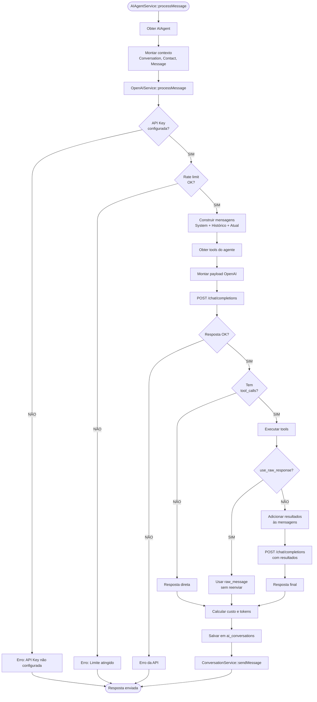

---

## 🛠️ DIAGRAMA 6: Execução de Tools

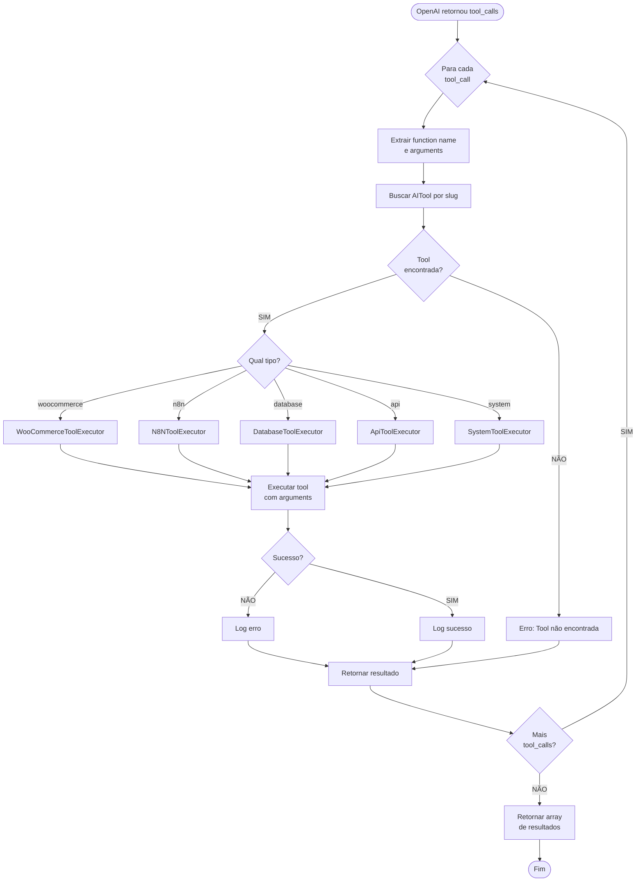

---

## 📊 DIAGRAMA 7: Métodos de Distribuição

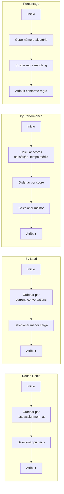

---

## 🎯 DIAGRAMA 8: Estados da Conversa

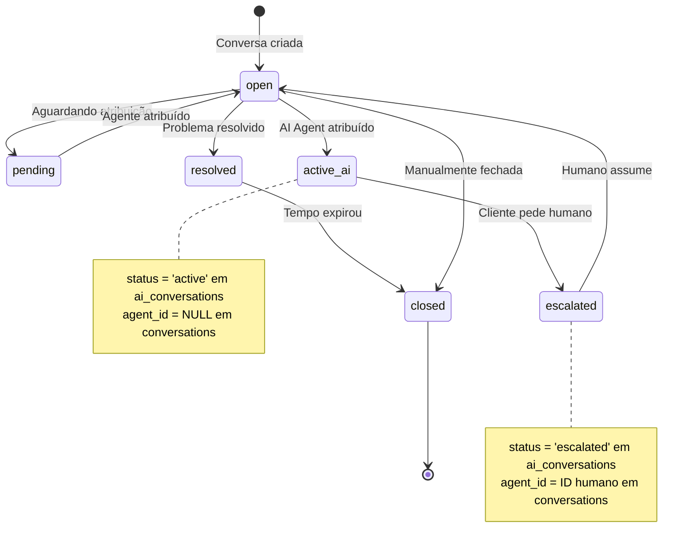

---

## 🔄 DIAGRAMA 9: Ciclo de Vida AIConversation

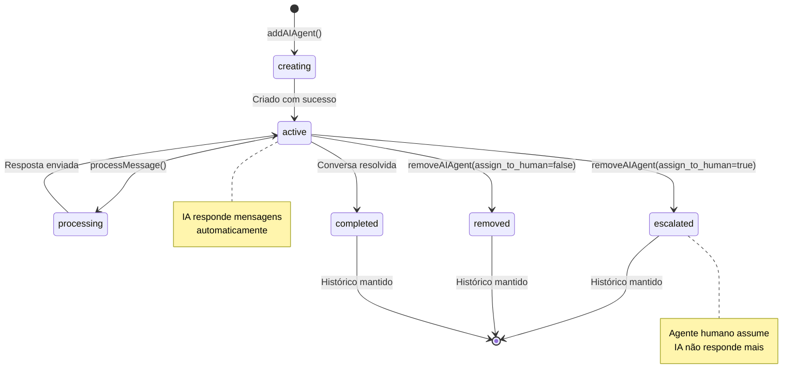

---

## 🌊 DIAGRAMA 10: Fluxo de AI Branching (Intents)

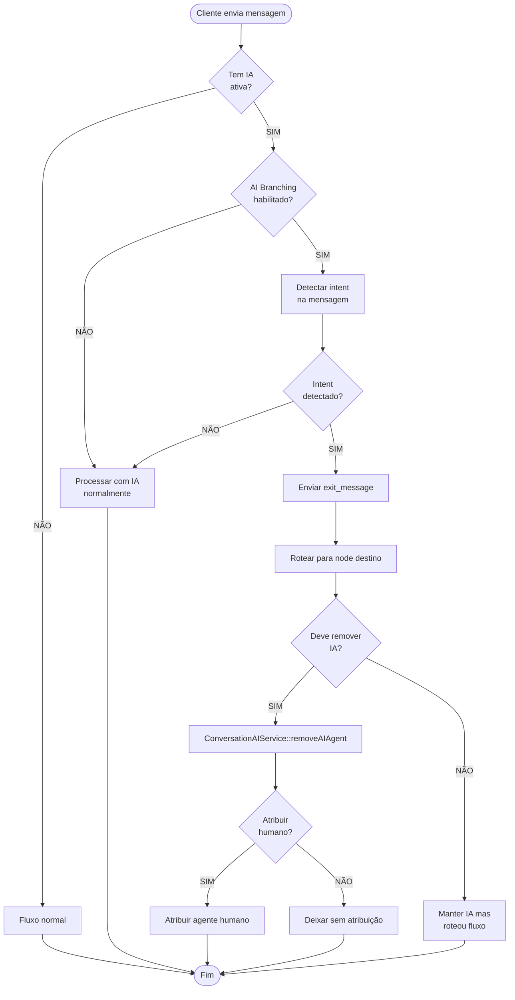

---

## 💰 DIAGRAMA 11: Cálculo de Custo

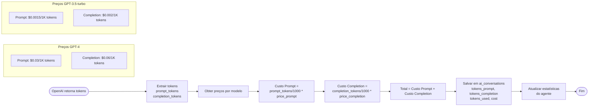

---

## 🎭 DIAGRAMA 12: Tipos de Agentes e Uso

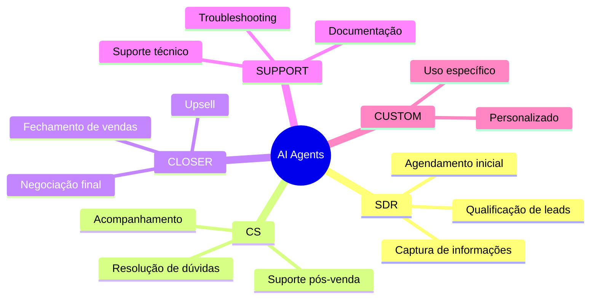

---

## 🔧 DIAGRAMA 13: Tipos de Tools

```mermaid
graph TD
    TOOLS[AI Tools] --> WOOCOMMERCE[WooCommerce]
    TOOLS --> N8N[N8N]
    TOOLS --> DATABASE[Database]
    TOOLS --> API[API]
    TOOLS --> SYSTEM[System]
    TOOLS --> DOCUMENT[Document]
    
    WOOCOMMERCE --> W1[Buscar Pedidos]
    WOOCOMMERCE --> W2[Buscar Produtos]
    WOOCOMMERCE --> W3[Atualizar Status]
    
    N8N --> N1[Workflows Personalizados]
    N8N --> N2[Integrações Complexas]
    N8N --> N3[Resposta Direta]
    
    DATABASE --> D1[Consultas SQL]
    DATABASE --> D2[Buscar Dados]
    DATABASE --> D3[Relatórios]
    
    API --> A1[HTTP Requests]
    API --> A2[APIs Externas]
    API --> A3[Webhooks]
    
    SYSTEM --> S1[Criar Conversa]
    SYSTEM --> S2[Atribuir Agente]
    SYSTEM --> S3[Mover Funil]
    
    DOCUMENT --> DO1[Base de Conhecimento]
    DOCUMENT --> DO2[FAQs]
    DOCUMENT --> DO3[Busca Semântica]
```

---

## 📈 DIAGRAMA 14: Monitoramento e Métricas

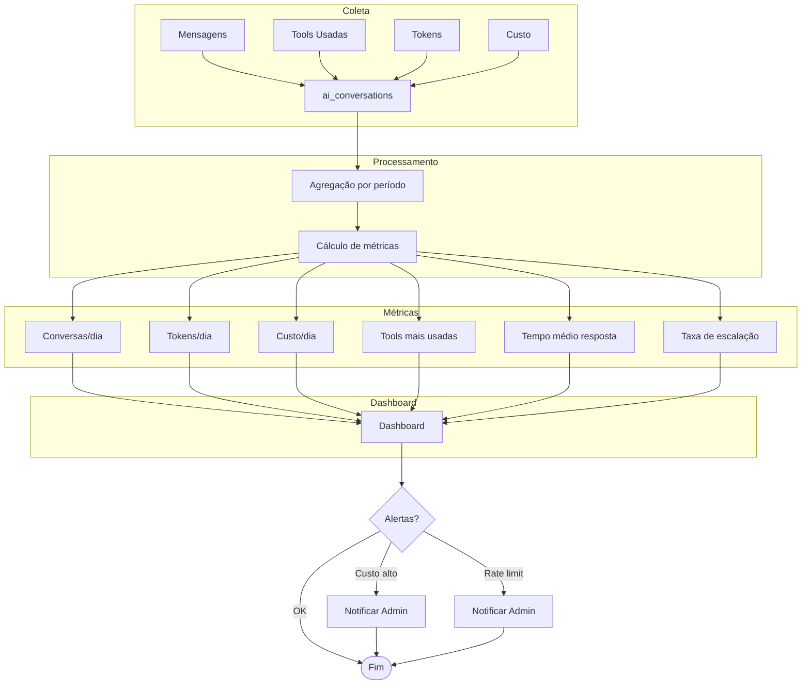

---

## 🎓 LEGENDA

### Símbolos Usados

- 🔷 **Decisão** - Diamante (sim/não)
- 📦 **Processo** - Retângulo
- 🔵 **Início/Fim** - Oval
- ➡️ **Fluxo** - Seta
- 🔴 **Estado** - Circle/Node

### Cores (quando aplicável)

- 🟢 **Verde** - Sucesso/OK
- 🔴 **Vermelho** - Erro/Falha
- 🟡 **Amarelo** - Atenção/Processando
- 🔵 **Azul** - Informação/Normal

---

**Documentação criada em:** 31/12/2025  
**Versão:** 1.0  
**Formato:** Mermaid Diagrams
