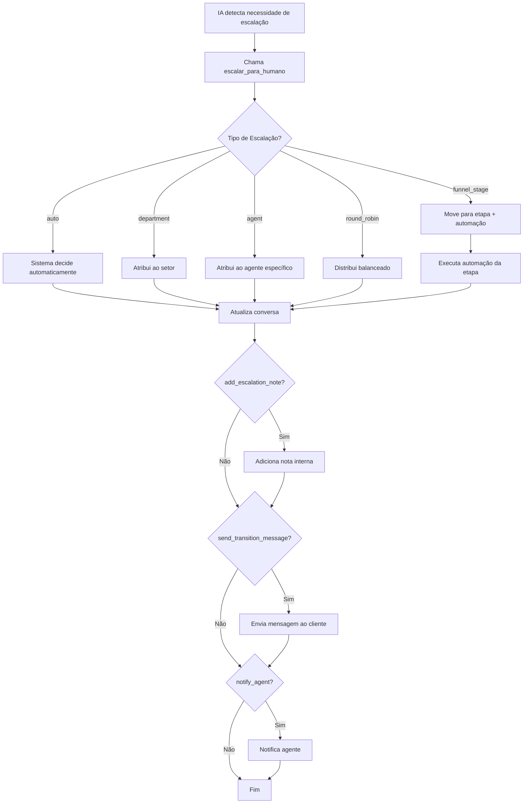

# 🤝 Sistema de Escalação para Agentes Humanos

**Data**: 2025-01-27  
**Status**: Implementado e Documentado

---

## 📋 VISÃO GERAL

O sistema permite que Agentes de IA escalem conversas para agentes humanos de forma inteligente e configurável, com múltiplas estratégias de atribuição.

---

## 🎯 TIPOS DE ESCALAÇÃO

### 1. **Auto (Automático)** ✅ Recomendado
```json
{
  "escalation_type": "auto"
}
```

**Como funciona:**
- Sistema usa regras de distribuição configuradas
- Considera carga de trabalho dos agentes
- Respeita setores e permissões
- Usa lógica do `ConversationService::autoAssignAgent()`

**Quando usar:**
- Configuração padrão
- Quando não há necessidade de atribuição específica
- Para distribuição equilibrada

---

### 2. **Department (Setor Específico)**
```json
{
  "escalation_type": "department",
  "department_id": 5
}
```

**Como funciona:**
- Atribui a um agente do setor especificado
- Usa round-robin dentro do setor
- Prioriza agentes com menos conversas ativas
- Verifica disponibilidade (status = active)

**Quando usar:**
- Cliente precisa de departamento específico (Vendas, Suporte, Financeiro)
- Especialização por área
- Compliance ou regras de negócio

**Exemplo de uso pela IA:**
```javascript
// Na tool escalar_para_humano
{
  "reason": "Cliente solicitou falar com setor financeiro",
  "notes": "Questão sobre fatura e pagamento"
}
```

---

### 3. **Agent (Agente Específico)**
```json
{
  "escalation_type": "agent",
  "agent_id": 42
}
```

**Como funciona:**
- Atribui diretamente ao agente especificado
- Verifica se agente existe e não é AI
- Valida se agente está ativo

**Quando usar:**
- Cliente solicitou agente específico (ex: "Quero falar com João")
- Continuidade de atendimento
- VIP ou casos especiais

**Exemplo:**
```javascript
{
  "reason": "Cliente solicitou falar com gerente João Silva",
  "notes": "Cliente é VIP, já teve atendimento anterior com este agente"
}
```

---

### 4. **Round Robin (Distribuição Balanceada)**
```json
{
  "escalation_type": "round_robin"
}
```

**Como funciona:**
- Distribui entre TODOS agentes disponíveis
- Prioriza quem tem menos conversas ativas
- Ignora setores (distribuição global)
- Adiciona aleatoriedade para empate

**Quando usar:**
- Distribuição uniforme entre equipe
- Não há especialização necessária
- Equipe pequena ou generalista

---

### 5. **Funnel Stage (Via Etapa do Funil)** 🎯 Mais Poderoso
```json
{
  "escalation_type": "funnel_stage",
  "funnel_stage_id": 8
}
```

**Como funciona:**
1. Move conversa para etapa específica do funil
2. Executa automação configurada naquela etapa
3. Automação pode:
   - Atribuir a agente/setor específico
   - Adicionar tags
   - Enviar mensagens
   - Mudar prioridade
   - Executar webhooks

**Quando usar:** ✅ **RECOMENDADO**
- Processos complexos de escalação
- Múltiplas ações além de atribuir
- Reutilizar lógica de automação existente
- Facilitar manutenção (tudo configurado na automação)

**Vantagens:**
- ✅ Não precisa configurar IDs na tool
- ✅ Usa automações já existentes
- ✅ Fácil de manter (altera automação, não tool)
- ✅ Pode executar múltiplas ações
- ✅ Logs e histórico de automação

**Exemplo de fluxo:**
```
1. IA detecta que cliente quer falar com vendedor
2. IA chama: escalar_para_humano(reason="Cliente quer orçamento")
3. Sistema move para etapa "Aguardando Vendedor" (ID 8)
4. Automação da etapa 8 executa:
   - Atribui ao setor de Vendas
   - Adiciona tag "orçamento"
   - Envia notificação ao time
   - Muda prioridade para "high"
```

---

## ⚙️ CONFIGURAÇÕES ADICIONAIS

### Prioridade
```json
{
  "priority": "urgent"  // low, normal, high, urgent
}
```

Define prioridade da conversa ao escalar.

---

### Nota de Escalação
```json
{
  "add_escalation_note": true
}
```

Adiciona nota interna com:
- 🤖 Motivo da escalação
- Método usado
- Observações da IA
- Data/hora
- Prioridade

**Exemplo de nota gerada:**
```
🤖 **Escalação Automática via IA**

**Motivo**: Cliente solicitou falar com gerente
**Método**: department
**Observações**: Cliente está insatisfeito com prazo de entrega
**Prioridade**: high
**Data/Hora**: 27/01/2025 14:35:22
```

---

### Notificação ao Agente
```json
{
  "notify_agent": true
}
```

Envia notificação ao agente atribuído:
- ✅ WebSocket (tempo real no sistema)
- 🔜 WhatsApp (planejado)
- 🔜 Email (planejado)

---

### Mensagem de Transição
```json
{
  "send_transition_message": true,
  "transition_message": "Vou transferir você para um especialista. Aguarde um momento."
}
```

Envia mensagem ao cliente informando a transferência.

---

## 🔧 CONFIGURAÇÃO NA INTERFACE

### Ao Criar/Editar Tool "Escalar para Humano"

1. **Tipo**: `system`
2. **Slug**: `escalar_para_humano`
3. **Configurações disponíveis:**

| Campo | Tipo | Descrição |
|-------|------|-----------|
| `escalation_type` | select | Tipo de escalação (auto, department, agent, round_robin, funnel_stage) |
| `department_id` | number | ID do setor (se type = department) |
| `agent_id` | number | ID do agente (se type = agent) |
| `funnel_stage_id` | number | ID da etapa (se type = funnel_stage) |
| `priority` | select | Prioridade (low, normal, high, urgent) |
| `add_escalation_note` | checkbox | Adicionar nota interna |
| `notify_agent` | checkbox | Notificar agente |
| `send_transition_message` | checkbox | Enviar mensagem ao cliente |
| `transition_message` | textarea | Texto da mensagem de transição |

---

## 📝 FUNCTION SCHEMA

A IA pode passar argumentos ao chamar a tool:

```json
{
  "type": "function",
  "function": {
    "name": "escalar_para_humano",
    "description": "Escala a conversa para um agente humano quando a situação requer intervenção humana",
    "parameters": {
      "type": "object",
      "properties": {
        "reason": {
          "type": "string",
          "description": "Motivo da escalação (ex: 'Cliente solicitou falar com gerente')"
        },
        "notes": {
          "type": "string",
          "description": "Observações adicionais ou contexto importante"
        }
      },
      "required": ["reason"]
    }
  }
}
```

---

## 💡 EXEMPLOS DE USO

### Exemplo 1: Escalação Simples (Auto)
```json
// Configuração da Tool
{
  "escalation_type": "auto",
  "priority": "normal",
  "add_escalation_note": true,
  "send_transition_message": true
}

// Chamada da IA
{
  "reason": "Cliente solicitou suporte técnico avançado",
  "notes": "Problema com integração API"
}
```

---

### Exemplo 2: Setor Específico (Financeiro)
```json
// Configuração da Tool
{
  "escalation_type": "department",
  "department_id": 3,  // ID do setor Financeiro
  "priority": "high",
  "add_escalation_note": true
}

// Chamada da IA
{
  "reason": "Cliente quer negociar pagamento",
  "notes": "Fatura vencida, cliente disposto a pagar com desconto"
}
```

---

### Exemplo 3: Via Etapa do Funil (Recomendado) ⭐
```json
// Configuração da Tool
{
  "escalation_type": "funnel_stage",
  "funnel_stage_id": 12,  // Etapa "Aguardando Vendedor"
  "priority": "high",
  "add_escalation_note": true,
  "send_transition_message": true,
  "transition_message": "Vou conectar você com nosso time de vendas!"
}

// Chamada da IA
{
  "reason": "Cliente interessado em plano Enterprise",
  "notes": "Empresa com 500+ funcionários, orçamento aprovado"
}

// A automação da etapa 12 faz:
// - Atribui ao setor de Vendas (round-robin)
// - Adiciona tags: "enterprise", "hot-lead"
// - Envia notificação ao gerente de vendas
// - Cria tarefa de follow-up
```

---

## 🎯 RECOMENDAÇÕES

### ✅ Use `funnel_stage` quando:
- Processo de escalação é complexo
- Precisa executar múltiplas ações
- Quer reutilizar lógica existente
- Facilitar manutenção

### ✅ Use `department` quando:
- Especialização clara por área
- Compliance ou regras de negócio
- Setores bem definidos

### ✅ Use `auto` quando:
- Não há requisitos específicos
- Quer distribuição inteligente
- Configuração padrão

### ✅ Use `agent` quando:
- Cliente solicitou agente específico
- Continuidade de atendimento
- Casos VIP

### ✅ Use `round_robin` quando:
- Equipe pequena e generalista
- Distribuição uniforme necessária
- Sem especialização

---

## 🔍 COMO DESCOBRIR IDs

### ID do Setor
```sql
SELECT id, name FROM departments;
```
Ou acesse: `/departments` na interface

### ID do Agente
```sql
SELECT id, name, email FROM users WHERE role IN ('agent', 'supervisor', 'admin');
```
Ou acesse: `/users` na interface

### ID da Etapa do Funil
```sql
SELECT id, name, funnel_id FROM funnel_stages;
```
Ou acesse: `/funnels` → Ver etapas

---

## 🚀 FLUXO COMPLETO



---

## 📊 LOGS E MONITORAMENTO

### Nota Interna Gerada
Toda escalação gera nota interna com:
- Motivo
- Método usado
- Observações
- Prioridade
- Timestamp

### WebSocket
Notificação em tempo real para:
- Agente atribuído
- Supervisores do setor
- Administradores

### Logs do Sistema
```php
error_log("Conversa {$conversationId} escalada via {$escalationMethod} para agente {$assignedTo}");
```

---

## 🔒 SEGURANÇA

- ✅ Valida se agente existe e está ativo
- ✅ Valida se agente não é AI
- ✅ Verifica permissões de setor
- ✅ Registra todas escalações
- ✅ Nota interna com contexto completo

---

## 📚 ARQUIVOS RELACIONADOS

- `app/Services/OpenAIService.php` - Lógica de escalação
- `views/ai-tools/show.php` - Interface de configuração
- `database/seeds/003_create_default_ai_tools.php` - Tool padrão
- `app/Services/ConversationService.php` - Auto-assign
- `app/Services/AutomationService.php` - Automações de etapa

---

## 🎓 EXEMPLOS PRÁTICOS

### Caso 1: E-commerce com Setores
```json
// Tool configurada com escalation_type = "department"
// Setor Vendas (ID 1)
// Setor Suporte (ID 2)
// Setor Financeiro (ID 3)

// IA detecta: "Quero saber sobre meu pedido"
{
  "reason": "Cliente quer rastrear pedido",
  "notes": "Pedido #12345"
}
// → Escala para Setor Suporte (ID 2)

// IA detecta: "Quero comprar 100 unidades"
{
  "reason": "Cliente quer orçamento bulk",
  "notes": "Empresa, pedido grande"
}
// → Escala para Setor Vendas (ID 1)
```

### Caso 2: Agência com Funis
```json
// Funil de Vendas:
// - Etapa 1: Qualificação (IA)
// - Etapa 2: Proposta (Vendedor)
// - Etapa 3: Negociação (Gerente)
// - Etapa 4: Fechamento (Vendedor)

// Tool configurada com escalation_type = "funnel_stage"
// funnel_stage_id = 2 (Proposta)

// IA qualifica lead e detecta interesse
{
  "reason": "Lead qualificado, pronto para proposta",
  "notes": "Budget: R$ 50k, decisor confirmado"
}
// → Move para Etapa 2
// → Automação atribui ao vendedor disponível
// → Adiciona tags, cria tarefa, notifica time
```

---

## ✅ CHECKLIST DE IMPLEMENTAÇÃO

- [x] Método `escalateToHuman()` no OpenAIService
- [x] Suporte a 5 tipos de escalação
- [x] Configurações na interface (system fields)
- [x] Function schema com parâmetros
- [x] Nota interna automática
- [x] Notificação WebSocket
- [x] Mensagem de transição ao cliente
- [x] Validações de segurança
- [x] Logs de debug
- [x] Documentação completa
- [ ] Notificação WhatsApp/Email (planejado)
- [ ] Dashboard de escalações (planejado)
- [ ] Métricas de tempo de escalação (planejado)

---

**Última atualização**: 27/01/2025  
**Versão**: 1.0.0

